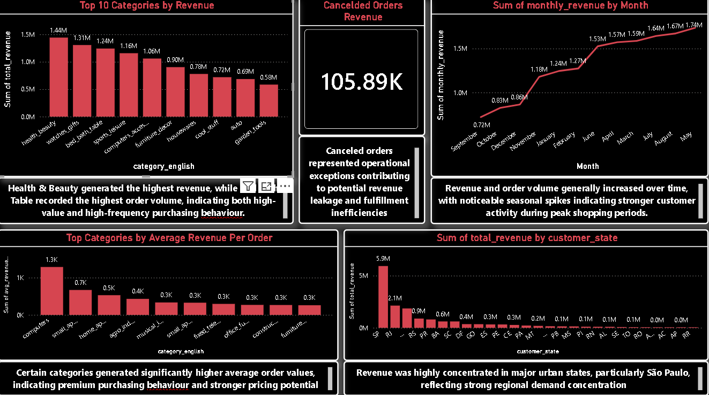

## Project Overview

This project is an end-to-end Business Intelligence case study analyzing e-commerce sales performance and customer behavior using Python, SQL, MySQL, and Power BI.

The objective was to clean and prepare raw transactional data, perform SQL-based business analysis, identify operational anomalies, and create dashboard visualizations to support business decision-making.

---

## Business Problem

Management wanted to better understand:

- Sales performance across product categories
- Customer purchasing behavior
- Monthly revenue trends and seasonality
- Regional sales distribution
- Operational anomalies such as canceled orders

The project focused on transforming raw datasets into actionable business insights.

---

## Tools & Technologies Used

- Python (Pandas)
- MySQL
- SQL
- Power BI
- PowerPoint

---

## Dataset

### Raw Dataset

The original public dataset used for this project is available on Kaggle:

https://www.kaggle.com/datasets/olistbr/brazilian-ecommerce

### Files Used

- olist_customers_dataset.csv
- olist_orders_dataset.csv
- olist_order_items_dataset.csv
- olist_products_dataset.csv
- product_category_name_translation.csv

---

## Data Cleaning & Preparation

The following preprocessing steps were performed:

- Loaded and explored raw CSV datasets
- Identified missing values and inconsistencies
- Removed duplicate merge columns
- Standardized missing categorical and numerical values
- Converted timestamps for time-series analysis
- Merged datasets into a single analytical dataset
- Exported a SQL-ready cleaned dataset

---

## SQL Analysis Performed

### 1. Top Product Categories
- Identified the highest revenue-generating categories
- Compared revenue vs order volume

### 2. Monthly Revenue Trends
- Analyzed seasonal purchasing behavior
- Identified sales growth patterns over time

### 3. Customer Distribution by State
- Evaluated regional revenue concentration
- Compared customer activity across states

### 4. Anomaly Analysis
- Investigated canceled orders
- Estimated potential revenue impact

### 5. Optional Strategic Analysis
- Calculated average revenue per order by category
- Identified premium purchasing behavior

---

## Power BI Dashboard

The Power BI dashboard includes:

- Top Categories by Revenue
- Monthly Sales Trends
- Revenue by Customer State
- Operational Anomaly Analysis
- Average Revenue per Order by Category

---

## Key Business Insights

- Health & Beauty generated the highest revenue
- Bed Bath Table had the highest order volume
- Revenue was concentrated heavily in major urban states
- Seasonal spikes indicated peak shopping periods
- Canceled orders represented operational revenue leakage
- Some categories showed significantly higher average order values

---

## Business Recommendations

- Increase focus on high-performing categories
- Expand premium product opportunities
- Improve operational handling of canceled orders
- Use regional insights for targeted marketing campaigns
- Improve product metadata completeness

---

## Repository Structure

```text
BI-Ecommerce-Sales-Analysis/
│
├── data/
├── notebooks/
├── sql/
├── dashboard/
├── presentation/
└── README.md
```

---

## Dashboard Preview


---

## Author

Karun Krishnan
